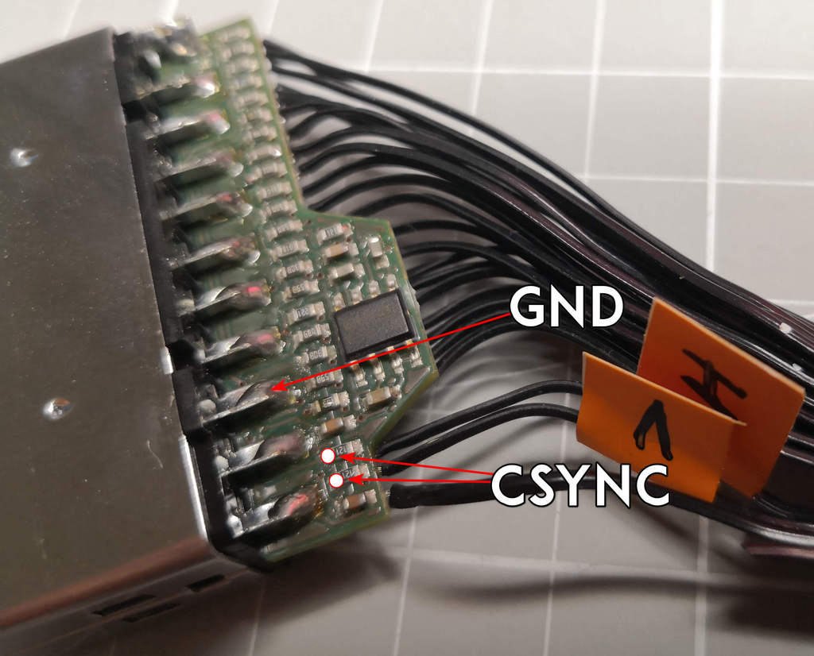

# RGBpi cable sync mixer

Small PCB mod to mix the sync in the RGBpi cable to solve sync issues

## Table of contents

- [Why](#why)
- [Description](#description)
- [Schematics](#schematics)
- [Install](#install)
- [Pics and final result](#pics-and-final-result)

## Why?

In order to eliminate/mitigate the sync issues on the cable we can do several options,
one is to use the common XOR mixer as usual, this other approach reduces the BOM
and enables the PCB to fit in the scart cable connector without any problem.

As you can see on this screenshot the original cable without modding induces a lot of 
DC bias on the sync causing some issues on some TVs, arcade monitors and so: 

With this mod we remove the DC offset not mixing into a full CSync signal but at least
we enable it to be used on more systems, of course the best approach is always the active sync
mixer with some gates but with this mod we restore at least the basic functionality.

Yes, the vertical period is not as good as with an active mixer but at least it removes the sync
issues on most devices with a very small BOM.

### OSSC comparison

Without modding:

Modded cable:

## Description

This is intended to be a very small PCB to be included inside the scart connector on the rgbpi cable.

It is valid for all the rgbpi cable versions, we will see on the installation procedure V1 and V2 cables.

In the BOM directory there's an interactive BOM with all the required components.

In the gerbers directory we have the gerbers to manufacture the boards.

In the KiCAD folder we can find the KiCAD project itself.

## Schematics

You can find here as well as the KiCAD files inside the KiCAD folder.

## Install

1- Send to manufacture the GERBER board to JLCPCB or other PCB manufacturer.

2- Get the components required, you can see here the Bill Of Materials [BOM](bom/ibom.html)

3- Solder the components.

4- Follow the procedure depending on your cable version.

### Detect your cable version

This is what we will call V1, follow the V1 install procedure:

This is what we will call V2, follow the V2 install procedure:

### V1 cable install

If your cable is V1 then:

* Check the wires for the installation

* Check the soldering positions

* Solder as shown (the big white cable is not required by this mod)

### V2 cable install

If your cable is V2 then:

* Check the wires for the installation

* Check the soldering positions

* Place as shown

* Solder the scart part (you can use for GND the 3rd pin from the bottom, it is better)

* Solder the cable hsync and vsync wires

### Pics and final result

V1:

V2

That's it.

I'm not responsible
============
And yes, read below, no responsibility taken on bad use.

Special thanks to Retroark [here on X](https://twitter.com/retroark) 

DISCLAIMER (See Licensing)
==========================
See LICENSE fo more information.
